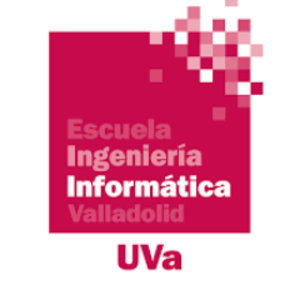

   

# Material docente.
## Asignatura PARADIGMAS DE PROGRAMACIÓN   
### Laboratorio. Grupos X7, X8 y X10

Escuela Ingeniería Informática UVa   

Curso 2025-26   

Prof.: **Jordi Pozo.**      

En este repositorio se encuentran los ejercicios de los laboratorios,los    
contenidos teóricos relativos a la parte práctica así como los enunciados   
<<<<<<< Updated upstream
de las prácticas y ejemplos varios sobre uso de python.
=======
de las prácticas y ejemplos varios sobre uso de python.    
>>>>>>> Stashed changes

Enlace a vídeo de configuración de [Python](https://youtu.be/H8wHilhhdxc)
